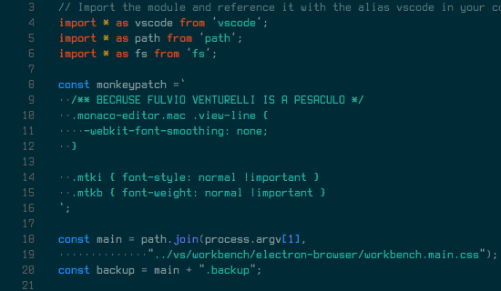
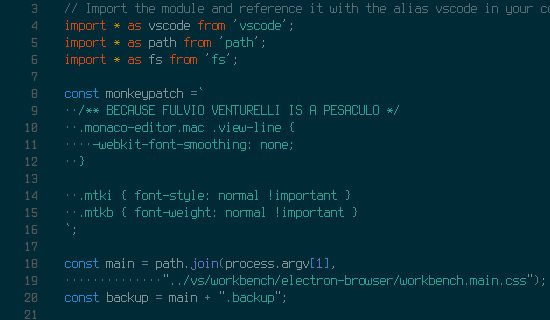

# Font Rough extension for VSCode (Mac OSX Only)

DISCLAIMER: The main reason of this extension is due the extreme laziness of
[Fulvio Venturelli](https://github.com/Fulviuus) - in italian we have a specific term for
that, it's _PESACULO_.

This extension is a dirty hack to permit the usage of fonts on OSX (such terminus) that
doesn't need antialiasing, patching the application's main css file.

Althought this could be done manually, at every VSCode update the changes are lost: this
extension ensure those changes are re-applied automatically in such cases.

See: [https://github.com/Microsoft/vscode/issues/2577](https://github.com/Microsoft/vscode/issues/2577)

## Features

Here how it looks Terminus with antialiasing (default behavior of VSCode):



And Here after the patch is applied.



## Installation

Downlod the latest extension's vsix package [here](https://github.com/ZER0/roughify/releases/download/v0.0.2/roughify-0.0.2.vsix).

From the terminal, you can install using the following command:

```
$ code --install-extension roughify-0.0.2.vsix
```

## Requirements

Due the nature of the CSS property used, it works only on Mac OS X.

## Extension Settings

None so far.

## Known Issues

VSCode is smart enough to recognize that the extension tampered its core files, so it will show a message box the first time, and "[Unsupported]" in the title bar.

## Release Notes

### 0.0.2

Initial release.
